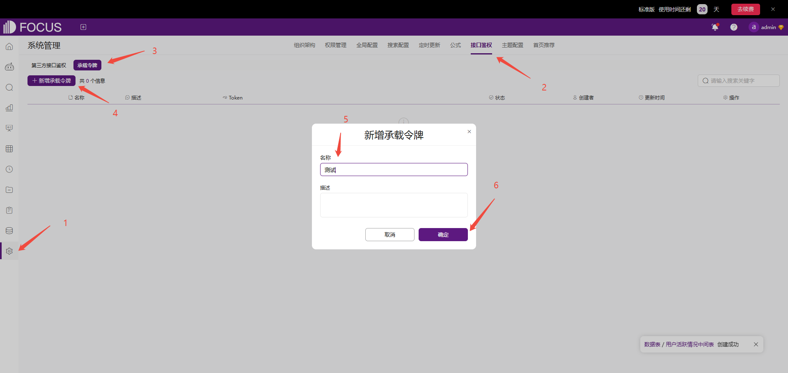
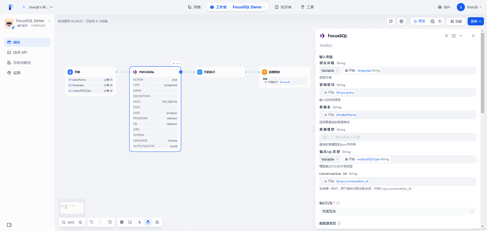
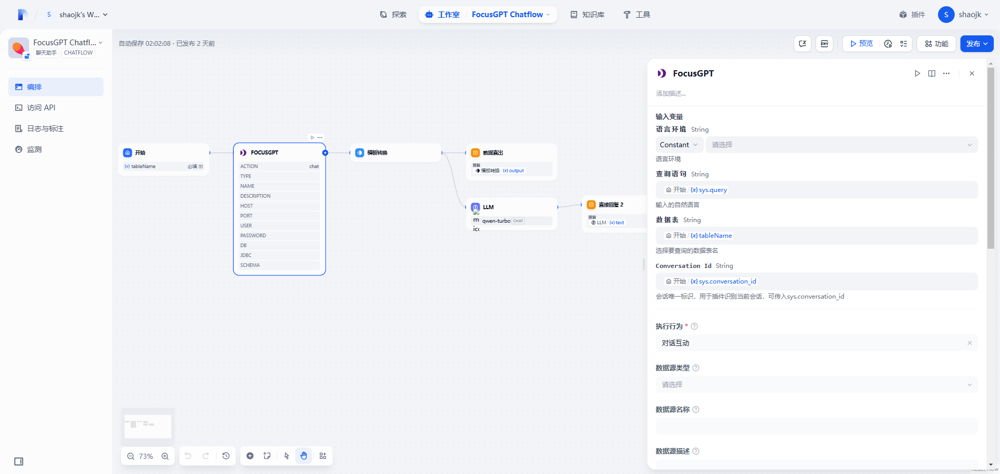

# Datafocus

## 语言/Language
- [中文](#中文)
- [English](#English)

## 中文

### 概览

DataFocus是一个集数据仓库、数据分析、智能问数BI于一体的BI平台，可以解析自然语言到SQL并查询出数据。

### 1. Dify插件完成授权

SAAS 授权：
在Datafocus鉴权处填写**token**和**host**完成授权认证，默认**host**地址：https://cloud001.datafocus.ai。

私有化部署：
私有化部署环境，**host**需要配置为私有化部署地址。

### 2. 获取DataFocus Token

SAAS：
如果你还没有DataFocus账户，可以前往[DataFocus官网](https://www.datafocus.ai/)申请。
登录DataFocus应用平台，点击**系统管理** > **接口鉴权** > **承载令牌** > **新增承载令牌**，创建一个新的Token。


私有化部署：
登录私有化部署的DataFocus应用平台，点击**系统管理** > **接口鉴权** > **承载令牌** > **新增承载令牌**，创建一个新的Token。

### 3. 使用插件

DataFocus包含两个工具——FocusSQL和FocusGPT。

#### FocusSQL

FocusSQL是一个基于关键词解析的自然语言转SQL插件。


##### 输出变量json

##### 

| 名称     | 类型   | 说明              |
| -------- | ------ | ----------------- |
| content  | string | 解析生成的SQL语句 |
| question | string | 解析生成的关键词  |
| type     | string | 返回类型          |

返回示例

```json
{
  "content": "select tbl_1882337315366133767.区域 as col_10715907381350065719,sum(tbl_1882337315366133767.销售数量) as col_9787758666777884439 from string tbl_1882337315366133767 group by tbl_1882337315366133767.区域 order by tbl_1882337315366133767.区域",
  "question": "区域 销售数量的总和",
  "type": "sql"
}
```

#### FocusGPT

FocusGPT是一个支持多轮对话的智能问数插件，可以使用自然语言直接从数据库中获取结果数据，并返回SQL。



##### 输出变量json

| 名称           | 类型       | 说明                           |
| -------------- | ---------- | ------------------------------ |
| code           | number     | 状态码                         |
| columns        | [[object]] | 二维数组，存放查询出的数据结果 |
| count          | number     | 返回数据的行数                 |
| duration       | string     | 查询执行耗时，单位秒s          |
| headers        | [object]   | 二维数组columns对应的列头信息  |
| » display      | string     | 列头显示名                     |
| » name         | string     | 列头原列名                     |
| » suf          | string     | 列头前缀，标识列的聚合方式     |
| sql            | [object]   | 查询数据对应的SQL              |
| »select_clause | string     | 查询数据对应的SQL              |
| title          | string     | 解析生成的关键词               |

返回示例

```json
{
  "code": 0,
  "columns": [
    [
      "2024-12-01 00:00:00.000",
      4901
    ],
    [
      "2025-01-01 00:00:00.000",
      4408
    ],
    [
      "2025-02-01 00:00:00.000",
      4223
    ],
    [
      "2025-03-01 00:00:00.000",
      4987
    ]
  ],
  "count": 4,
  "duration": "0.334571",
  "headers": [
    {
      "display": "订单日期(MONTHLY)",
      "name": "订单日期",
      "suf": "MONTHLY"
    },
    {
      "display": "销售数量(SUM)",
      "name": "销售数量",
      "suf": "SUM"
    }
  ],
  "sql": {
    "from_clause": "",
    "group_by_clause": "",
    "having_clause": "",
    "order_by_clause": "",
    "select_clause": "select date_trunc('month', \"电商销售数据gauss\".\"订单日期\") as col_0,sum(\"电商销售数据gauss\".\"销售数量\") as col_1 from \"电商销售数据gauss\" group by date_trunc('month', \"电商销售数据gauss\".\"订单日期\") order by date_trunc('month', \"电商销售数据gauss\".\"订单日期\")",
    "where_clause": ""
  },
  "title": "每月 销售数量"
}
```

#### 配置说明

FocusSQL和FocusGPT的配置几乎一样，以下是每个配置的功能和使用方式。

| Parameter       | Description                                                  |
| --------------- | ------------------------------------------------------------ |
| 语言环境        | 语言解析环境，仅支持中文和英文                               |
| 查询语句        | 查询语句，插件根据参数输入生成SQL或查询数据                  |
| 数据表名        | 查询的数据表名                                               |
| 数据模型        | 这是一个高级功能，允许用户自定义数据表模型。详见[Model参数](#Model参数) |
| 输出SQL类型     | FocusSQL输出SQL的类型                                        |
| Conversation Id | 会话唯一标识，用于插件识别会话保持会话状态                   |
| 执行行为        | 工具可执行行为，①获取表列表；②对话互动                       |
| 数据源类型      | 连接外部数数据源类型。如果指定了数据源类型，则需要填写下方的数据源连接参数。如果不填写该值，将从DataFocus应用中选取表。 |
| Host地址        | Host地址                                                     |
| 端口            | 端口                                                         |
| 数据库用户      | 数据库用户                                                   |
| 数据库密码      | 数据库密码                                                   |
| 数据库名        | 数据库名                                                     |
| JDBC            | JDBC                                                         |
| Schema          | Schema                                                       |

#### Model参数

数据模型Model需要传入一个JSON字符串，Model结构如下

##### 结构

| 名称                 | 类型     | 必选 | 说明                     |
| -------------------- | -------- | ---- | ------------------------ |
| type                 | string   | 是   | 数据库类型               |
| version              | string   | 是   | 数据库版本               |
| tables               | [object] | 是   | 表结构列表               |
| » tableDisplayName   | string   | 否   | 表显示名                 |
| » tableName          | string   | 否   | 表原始名                 |
| » columns            | [object] | 否   | 表列列表                 |
| »» columnDisplayName | string   | 是   | 列显示名                 |
| »» columnName        | string   | 是   | 列原始名                 |
| »» dataType          | string   | 是   | 列数据类型               |
| »» aggregation       | string   | 是   | 列聚合方式               |
| relations            | [object] | 是   | 表关联关系列表           |
| » conditions         | [object] | 否   | 关联条件                 |
| »» dstColName        | string   | 否   | dimension 表关联列原始名 |
| »» srcColName        | string   | 否   | fact 表关联列原始名      |
| » dimensionTable     | string   | 否   | dimension 表原始名       |
| » factTable          | string   | 否   | fact 表原始名            |
| » joinType           | string   | 否   | 关联类型                 |

##### 枚举值

###### type 数据库类型

| 值         | 含义             |
| ---------- | ---------------- |
| mysql      | mysql数据库      |
| clickhouse | clickhouse数据库 |
| impala     | impala数据库     |

###### dataType 数据类型

| 值        | 含义     |
| --------- | -------- |
| boolean   | 布尔类型 |
| int       | 整型     |
| bigint    | 长整型   |
| double    | 浮点型   |
| string    | 字符串   |
| timestamp | 时间戳   |
| date      | 日期类型 |
| time      | 时间类型 |

###### aggregation 聚合方式

| 值             | 含义     |
| -------------- | -------- |
| SUM            | 求和     |
| AVERAGE        | 平均值   |
| MIN            | 最小值   |
| MAX            | 最大值   |
| COUNT          | 数量     |
| COUNT_DISTINCT | 去重数量 |
| VARIANCE       | 方差     |
| STD_DEVIATION  | 标准差   |
| NONE           | 无       |

###### joinType 关联方式

| 值         | 含义   |
| ---------- | ------ |
| LEFT JOIN  | 左关联 |
| RIGHT JOIN | 右关联 |
| INNER JOIN | 内关联 |
| FULL JOIN  | 全关联 |

##### 例子

model

```json
{
  "type": "mysql",
  "version": "8.0",
  "tables": [
    {
      "tableDisplayName": "string",
      "tableName": "string",
      "columns": [
        {
          "columnDisplayName": null,
          "columnName": null,
          "dataType": null,
          "aggregation": null
        }
      ]
    }
  ],
  "relations": [
    {
      "conditions": [
        {
          "dstColName": null,
          "srcColName": null
        }
      ],
      "dimensionTable": "string",
      "factTable": "string",
      "joinType": "LEFT JOIN"
    }
  ]
}
```

### 咨询


## English

### Overview

The DataFocus tool can help you to query database data or generate SQL statements with natural language. The following will introduce how to configure and an example demonstration.

### 1. Apply for DataFocus Token

If you don't have the DataFocus application yet, please apply for one on the [DataFocus Website](https://www.datafocus.ai/en).
Log in to your DataFocus application. Click **Admin** > **Interface Authentication** > **Bearer Token** > **New Bearer Token**, to create a new token and get _the token value_.

If you have a DataFocus private deployment environment, you can get Token on your own environment.

### 2. Fill in the configuration in Dify

Install DataFocus from Marketplace and fill **token** and **host** in the authorization page.
Token is the value obtained in the previous step.
If you have a DataFocus private deployment environment, host is your environment host. Otherwise, the SAAS environment address can be used by default. 

### 3. Use the tool

DataFocus includes two tools, FocusSQL and FocusGPT.

#### FocusSQL

FocusSQL is a natural language to SQL plugin based on keyword parsing.


##### Output Variable JSON

| Name     | Type   | Description              |
| -------- | ------ | ------------------------ |
| content  | string | Generated SQL statements |
| question | string | Generated keywords       |
| type     | string | Return type              |

Output Example

```json
{
  "content": "select tbl_1882337315366133767.区域 as col_10715907381350065719,sum(tbl_1882337315366133767.销售数量) as col_9787758666777884439 from string tbl_1882337315366133767 group by tbl_1882337315366133767.区域 order by tbl_1882337315366133767.区域",
  "question": "区域 销售数量的总和",
  "type": "sql"
}
```

#### 

#### FocusGPT

FocusGPT is an intelligent query plugin that supports multiple rounds of conversations, which allow you query data from your database. 
FocusGPT not only can return query SQL but also return query result to you.


##### Output Variable JSON

| 名称           | 类型       | 说明                           |
| -------------- | ---------- | ------------------------------ |
| code           | number     | 状态码                         |
| columns        | [[object]] | 二维数组，存放查询出的数据结果 |
| count          | number     | 返回数据的行数                 |
| duration       | string     | 查询执行耗时，单位秒s          |
| headers        | [object]   | 二维数组columns对应的列头信息  |
| » display      | string     | 列头显示名                     |
| » name         | string     | 列头原列名                     |
| » suf          | string     | 列头前缀，标识列的聚合方式     |
| sql            | [object]   | 查询数据对应的SQL              |
| »select_clause | string     | 查询数据对应的SQL              |
| title          | string     | 解析生成的关键词               |

Output Example

```json
{
  "code": 0,
  "columns": [
    [
      "2024-12-01 00:00:00.000",
      4901
    ],
    [
      "2025-01-01 00:00:00.000",
      4408
    ],
    [
      "2025-02-01 00:00:00.000",
      4223
    ],
    [
      "2025-03-01 00:00:00.000",
      4987
    ]
  ],
  "count": 4,
  "duration": "0.334571",
  "headers": [
    {
      "display": "订单日期(MONTHLY)",
      "name": "订单日期",
      "suf": "MONTHLY"
    },
    {
      "display": "销售数量(SUM)",
      "name": "销售数量",
      "suf": "SUM"
    }
  ],
  "sql": {
    "from_clause": "",
    "group_by_clause": "",
    "having_clause": "",
    "order_by_clause": "",
    "select_clause": "select date_trunc('month', \"电商销售数据gauss\".\"订单日期\") as col_0,sum(\"电商销售数据gauss\".\"销售数量\") as col_1 from \"电商销售数据gauss\" group by date_trunc('month', \"电商销售数据gauss\".\"订单日期\") order by date_trunc('month', \"电商销售数据gauss\".\"订单日期\")",
    "where_clause": ""
  },
  "title": "每月 销售数量"
}
```

#### 

#### Configuration

FocusSQL and FocusGPT have similar configuration. Below are the functions and usage instructions of each parameter

| Parameter       | Description                                                  |
| --------------- | ------------------------------------------------------------ |
| Language        | Language environment, only support *Chinese* and *English*   |
| Query Statement | Natural language input by users                              |
| Table Name      | Target data table for query                                  |
| Data Model      | Custom model parameter entry                                 |
| Output SQL Type | Output SQL Type                                              |
| Conversation Id | Unique identifier of the session, which allow tool identify and maintain session state |
| Action          | The behavior of tool execution currently includes two types: obtaining table lists and dialogues |
| Datasource Type | Types of external data sources connected. If datasource type was selected, the connection parameters below need to be filled in |
| Host            | host                                                         |
| Port            | port                                                         |
| DB user         | user                                                         |
| DB Password     | password                                                     |
| Database Name   | database name                                                |
| JDBC            | JDBC                                                         |
| Schema          | Schema name                                                  |

#### Model Parameters

The data model needs to pass in a JSON string, and the structure of the model is as follows

##### Structure

| Name                 | Type     | Required | Description                    |
| -------------------- | -------- | -------- | ------------------------------ |
| type                 | string   | 是       | Database type                  |
| version              | string   | 是       | Database version, eg: 8.0      |
| tables               | [object] | 是       | Table structure list           |
| » tableDisplayName   | string   | 否       | Table display name             |
| » tableName          | string   | 否       | Original table name            |
| » columns            | [object] | 否       | Columns structure list         |
| »» columnDisplayName | string   | 是       | Column display name            |
| »» columnName        | string   | 是       | Original column name           |
| »» dataType          | string   | 是       | Column data type               |
| »» aggregation       | string   | 是       | Column default aggregation     |
| relations            | [object] | 是       | Association relationship list  |
| » conditions         | [object] | 否       | Associated conditions          |
| »» dstColName        | string   | 否       | Dimension original column name |
| »» srcColName        | string   | 否       | Fact original column name      |
| » dimensionTable     | string   | 否       | Dimension original table name  |
| » factTable          | string   | 否       | Fact original table name       |
| » joinType           | string   | 否       | Association type               |

##### Parameter values

###### type

| DataBase   | Value      |
| ---------- | ---------- |
| MySQL      | mysql      |
| ClickHouse | clickhouse |
| Impala     | impala     |

###### dataType 

| DataType     | Value     |
| ------------ | --------- |
| Boolean      | boolean   |
| Integer      | int       |
| Long integer | bigint    |
| Float        | double    |
| String       | string    |
| Timestamp    | timestamp |
| Date type    | date      |
| Time type    | time      |

###### aggregation

| Aggregation            | Value          |
| ---------------------- | -------------- |
| Sum                    | SUM            |
| Mean                   | AVERAGE        |
| Min                    | MIN            |
| Max                    | MAX            |
| Count                  | COUNT          |
| Number of deduplicates | COUNT_DISTINCT |
| Variance               | VARIANCE       |
| Standard deviation     | STD_DEVIATION  |
| None                   | NONE           |

###### joinType

| Assocation        | Value      |
| ----------------- | ---------- |
| Left association  | LEFT JOIN  |
| Right association | RIGHT JOIN |
| Internal          | INNER JOIN |
| Fully associative | FULL JOIN  |

##### Example

model

```json
{
  "type": "mysql",
  "version": "8.0",
  "tables": [
    {
      "tableDisplayName": "string",
      "tableName": "string",
      "columns": [
        {
          "columnDisplayName": null,
          "columnName": null,
          "dataType": null,
          "aggregation": null
        }
      ]
    }
  ],
  "relations": [
    {
      "conditions": [
        {
          "dstColName": null,
          "srcColName": null
        }
      ],
      "dimensionTable": "string",
      "factTable": "string",
      "joinType": "LEFT JOIN"
    }
  ]
}
```


### Consult

[](https://discord.gg/TUahEW2C)

[DataFocus Discord](https://discord.gg/TUahEW2C)

